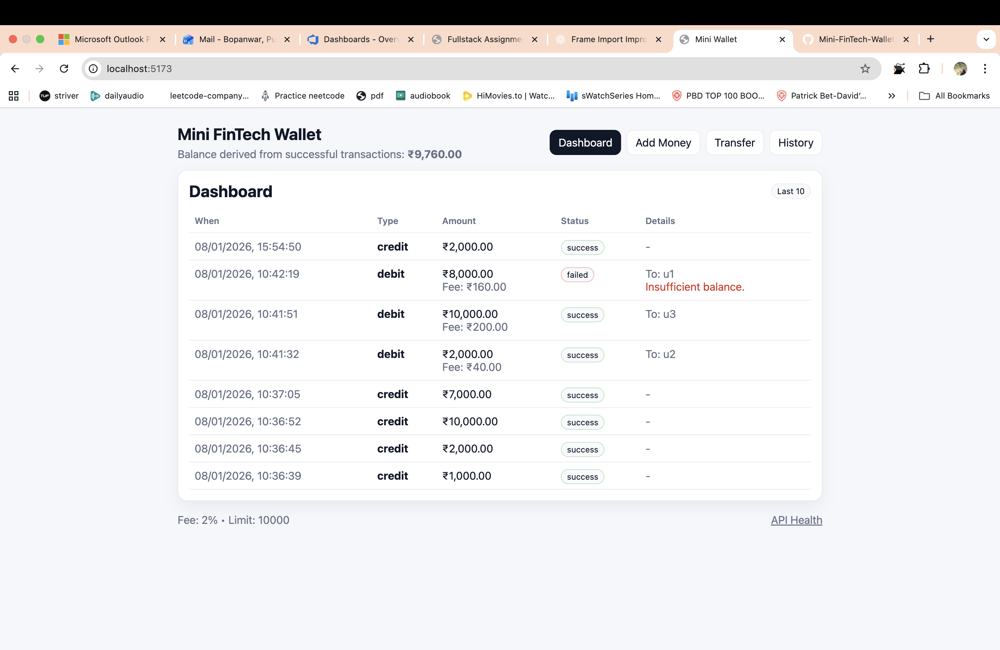
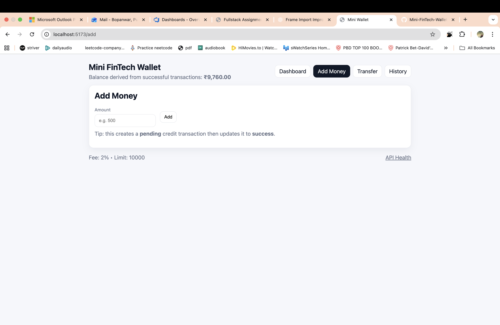
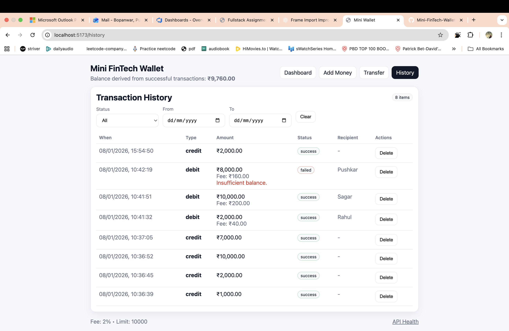
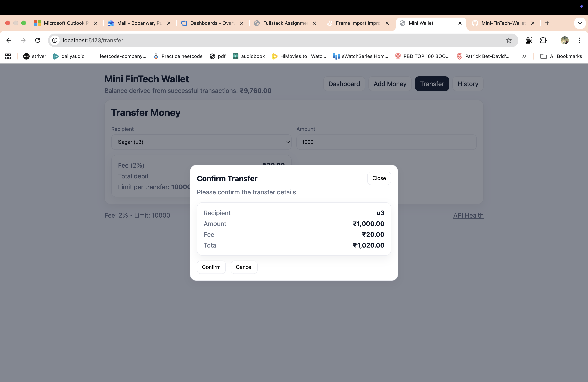

# 💳 Mini FinTech Wallet (Option B – React + Express + JSON Storage)

A full-stack **Mini FinTech Wallet** web application that allows users to view wallet balance, manage transactions, add money, and transfer funds while applying real-world business rules such as transaction fees and limits.

This project was developed as part of a **Full-Stack Developer Assignment**.

---

## 🚀 Tech Stack

- **Frontend:** React (Vite) + Hooks + React Router
- **Backend:** Node.js + Express
- **Storage:** JSON file (no MongoDB / SQL)
- **API Client:** Fetch / Axios

---

## ⚙️ Prerequisites

- Node.js **v18+**
- npm

---

## ▶️ Quick Start (2 Terminals)

### Backend

```bash
cd backend
npm install
npm run dev
```

Backend runs at: `http://localhost:4000`

### Frontend

```bash
cd frontend
npm install
npm run dev
```

Frontend runs at: `http://localhost:5173`

---

## 📌 API Endpoints

- `GET /users`
- `GET /transactions`
- `POST /transactions`
- `PATCH /transactions/:id`
- `DELETE /transactions/:id` (soft delete)
- `GET /config` (transaction fee & limit)

---

## 🚀 Features

### Dashboard

- Displays current wallet balance
- Shows last 10 transactions
- Loading & empty states

### Add Money

- Validated amount input
- Records a **credit transaction**
- Balance updates after successful API call

### Transfer Money

- Transfer money to another user
- **2% transaction fee**
- **Maximum per-transaction limit: ₹10,000**
- Confirmation modal before transfer
- Records **debit + fee**

### Transaction History

- Filter by status and date
- Soft delete support

---

## 📸 Screenshots

### Dashboard



### Add Money



### Transfer Money


### Transaction History



### Fee Calculation



---

## 👤 Author

**Pushkar Bopanwar**
